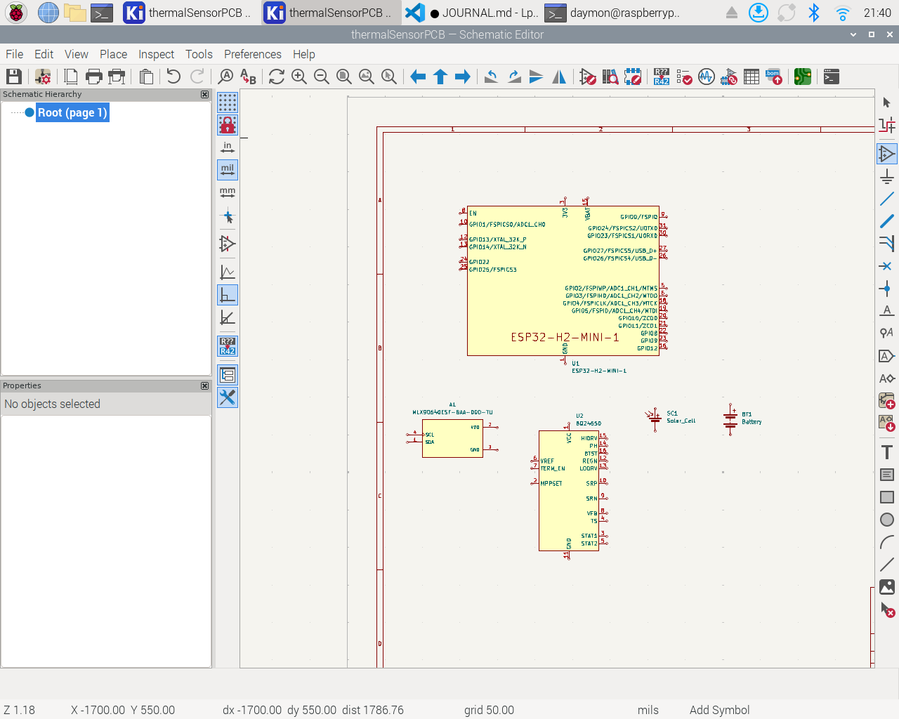

# May 25: Beginning research and brainstorming
Session length: 2 hours

This session was mostly focused on deciding what thermal sensor and microcontroller to use. I have tentatively decided on the MLX90640 for the thermal sensor. It is a 32x24 array of infrared sensors.
I debated about going with a 16x12 array, but I decided that the additional resolution would be better, and the 32x24 doesn't cost that much more. The sensor appears to be ~$30, I still need to compare vendors and find the best price.
For the microcontroller, I'm thinking about the ESP32-H, but I need to do a little more research before I decide for sure. I want something that supports zigbee.

I also created a basic list of requirements of the PCB and case:

**PCB**
+ Thermal sensor
  + MLX90640
+ Microprocessor
  + Preferably Zigby
  + Alternatively wifi
    + Need to check signal strength on that side of the house
+ Battery
+ Solar panel

**Case**
+ Some degree of waterproofness
  + Not submergible, but withstand heavy rain
+ Mount to something
  + Options:
    + Side of the house
      + This might interfere with the effectiveness of solar panels due to shade
    + Pole stuck in the ground
  + Should withstand moderate to heavy winds

 Finally, I set up the git repository and journal file. Probably should have have done this first, but at least I did it before I have files to commit.

# May 28: Final part selection
Session length: 3 hours

Today I made the (hopefully) final decisions on most of my parts. They are as follows:

**Thermal Sensor Array**:
As mentioned earlier, I deiced on the MLX90640. The 32x24 resolution will allow for a more precise estimate of the propane level. Assuming the entire array is focused on the tank, we should be able to estimate the propane level within 3 points.

**Microcontroller**:
After more research, I have deiced to go with the ESP32-H2-MINI-1. The main deciding factors were the Zigbee support, and low power draw. I debated about the C5, but I don't think I need the added features, and lacks the ultra-low power draw of the H2. 

**Charge controller**:
I'm going with the BQ24650. I'm not 100% sure I need a charge controller, it will depend on the size of battery and solar panel I get. But better safe then sorry, particularly when it's less than $5. 

I haven't decided on what solar panel and battery to go with, but I don't need to know those to start wiring. 

Having deiced on my parts I hunted down KiCAD symbols for all of them. KiCAD already had a symbol for the charge controller, but I had to download symbols for the sensor array and microcontroller. My computer decided to freeze up a few times, so it took a lot longer than it should have. Problems aside, I think I'm ready to start wiring! I started looking into how to wire the charge controller, but didn't get to placing any wires down.

